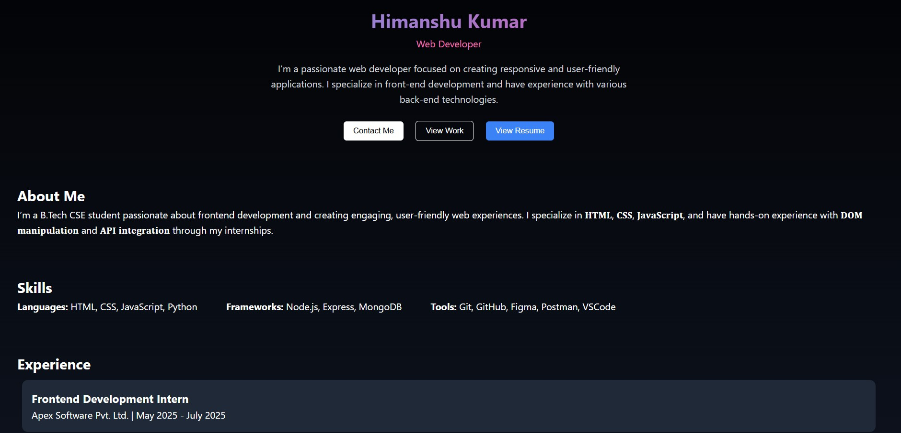

# 💼 Portfolio Website

A responsive personal portfolio website built using **HTML**, **CSS**, and **JavaScript**.
It showcases my skills, projects, experience, and contact information.

---

## 📸 Preview


---

## 🌐 Live Demo
https://himanshu4812.github.io/Portfolio/

---

## 🛠 Tech Stack
- HTML5
- CSS3
- JavaScript (Vanilla)

---

## 🚀 Features
- Responsive design
- Smooth scroll on button click
- Contact form with JS alert simulation
- Sections: About, Skills, Projects, Experience, Education, Contact

---

## 📂 Folder Structure
```
portfolio-website/
├── index.html
├── style.css
├── script.js
├── img/
│   ├── project1.png
│   ├── project2.png
│   └── project3.png
```

---

## 📜 Setup Instructions
1. Clone this repo or download the ZIP
2. Open `index.html` in any browser

```bash
# Clone the repository
git clone https://github.com/yourusername/portfolio-website.git
cd portfolio-website
```

---

## 🎯 Future Enhancements
- Add contact form integration with EmailJS or Formspree
- Theme switcher (dark/light mode)
- Add animation effects (AOS or GSAP)

---

## 🙋‍♂️ Author
**Himanshu Kumar**  
[LinkedIn](https://www.linkedin.com/in/himanshu-kumar-389a85273/)  
[GitHub](https://github.com/himanshu4812)

---

## 📄 License
